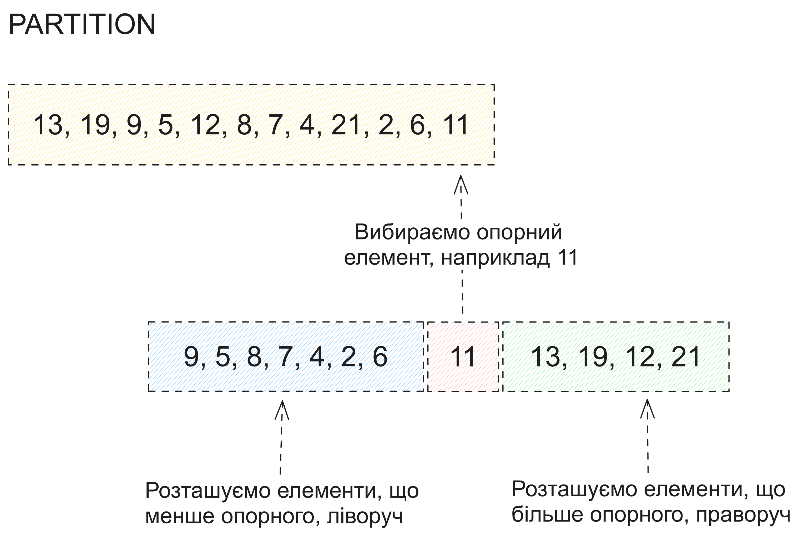
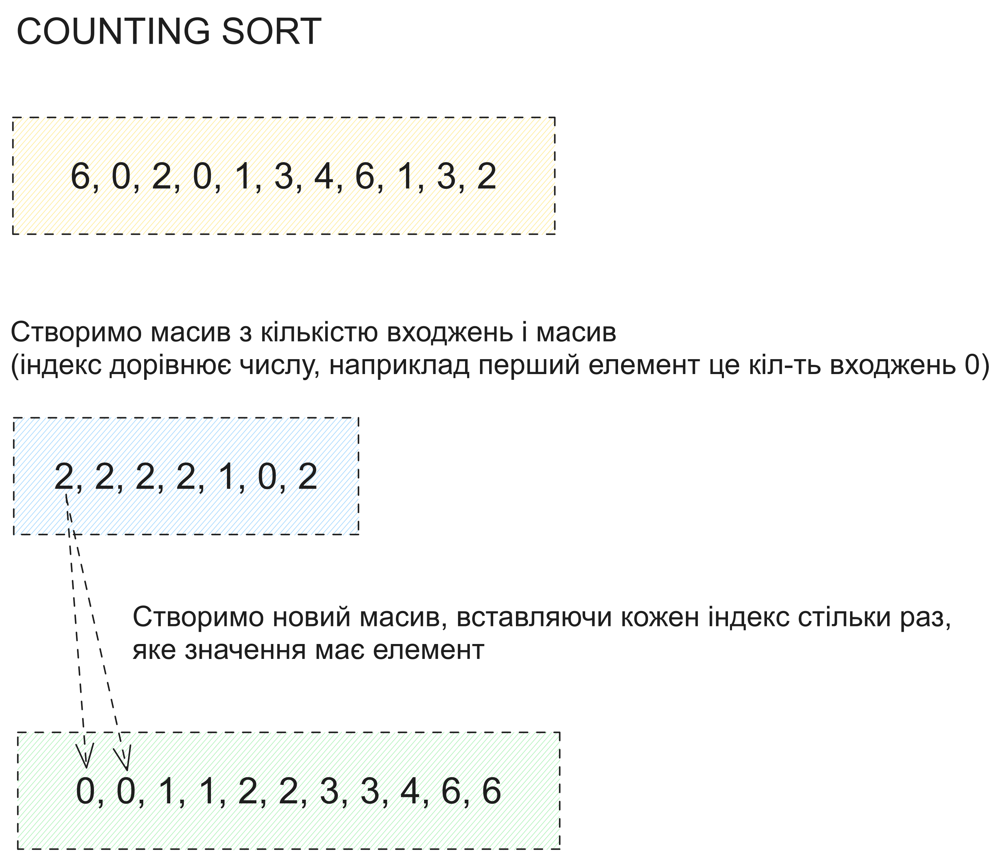
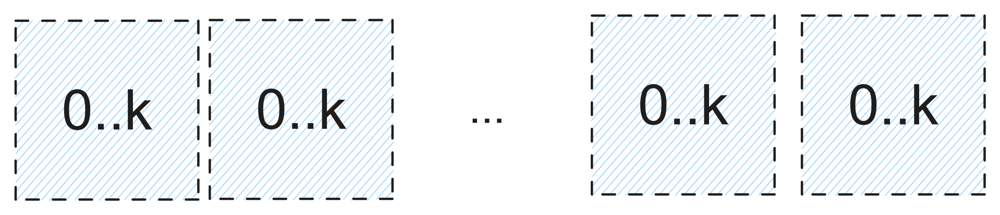

# Лабораторна робота №2

## Умова

### Завдання 1

Проілюструйте роботу процедури PARTITION з масивом
А = (13,19,9,5,12,8,7,4,21,2,6,11).

### Завдання 2

Яке значення q повертає процедура PARTITION, якщо всі елементи масиву А[р...r] однакові? Модифікуйте цю процедуру так, щоб у випадку, коли всі елементи масиву А[р...r] мають те саме значення, q визначається наступним чином: q= (p+r)/2

### Завдання 3

Напишіть процедуру QUICKSORT для сортування у незростаючому порядку.

### Завдання 4

Напишіть процедуру RANDOMIZED-QUICKSORT для сортування у незростаючому порядку.

### Завдання 5

Проілюструйте обробку масиву А = (6,0,2,0,1,3,4,6,1,3,2) процедурою COUNTING-SORT.

### Завдання 6

Опишіть алгоритм попередньої обробки n елементів, що належать інтервалу від 0 до k, після якого можна отримати відповідь на запит про те, скільки з n вхідних елементів належать відрізку [а…b], за час 0(1). Алгоритм повинен виконуватись за час Θ(n+k)

### Завдання 7

Проілюструйте роботу алгоритму RADIX-SORT з наступним списком англійських слів: COW, DOG, SEA, RUG, ROW, MOB, BOX, TAB, BAR, EAR, TAR, DIG, BIG, TEA, NOW, FOX.

### Завдання 8

Проілюструйте роботу алгоритму BUCKET-SORT з масивом А = (.79, .13, .16, .64, .39, .20, .89, .53, .71, .42).

### Завдання 9

Ви працюєте консультантом у нафтовій компанії, яка планує провести магістральний трубопровід від східного до західного краю нафтового родовища зі свердловинами. Від кожної свердловини до магістрального трубопроводу найкоротшим шляхом у напрямку на північ або на південь проведені рукави. Яким чином Ви може вибрати оптимальне розташування трубопроводу (тобто таке, при якому загальна довжина всіх рукавів була б мінімальною) за заданими координатами свердловин (х, у)? Покажіть, що це можна зробити протягом часу, що лінійно залежить від кількості свердловин.

## Аналіз

### Завдання 1

PARTITION опереція, на прикладі масиву [13, 19, 9, 5, 12, 8, 7, 4, 21, 2, 6, 11]. За опорний елемент візьмемо `11`. Також ця операція повертає індекс опорного елемента після разподілу.



### Завдання 2

Ми просто модифікуємо операцію Partition, щоб перевіряти, що хоча б 1 елемент відрізняється від інших. Якщо після циклу флаг `allEqual` дорівнює `True`, то повернимо індекс середини.

Ми можемо оптимізувати перевірку на ідентичність, якщо будемо використовувати `Strategy`. Після першого елементу, що не дорівнює arr[0], ми будумо замінювати функцію перевірки на `пустишку`. Пустишка не буде робити жодної перевірки. Але це на потім

### Завдання 3-4

Знайдемо алгоритм в інтернеті, а краще запитаємо у ChatGPT. Потім перевіримо, чи він працює, та розберемо як.

Randomized Quick Sort відрізняється від Quick Sort тим, що ми випадково вибираємо опорний елемент для Partition.

### Завдання 5



### Завдання 6



Такий адгоритм буде схожим на COUNTING SORT. Так само ми розкидаємо елементи по масивах, що відпоівдають діапазону.

### Завдання 7


### Завдання 8


### Завдання 9

В нас чітко написано, що магістральний трубопровід йде горизонтально. Тож треба лише порахувати середню вертикальну координату серед всіх свердловин.

## Текст програми

Program.cs

```cs
using Lab2;

int[] initialArray = [5, 2, 9, 1, 5, 6];
Console.WriteLine("Original array:");
PrintArray(initialArray);

int[] array = initialArray;
Sort.QuickSortDesc(array, 0, array.Length - 1);
Console.WriteLine("\nSorted array in non-decreasing order:");
PrintArray(array);

array = initialArray;
Sort.RandomizedQuickSortDesc(array, 0, array.Length - 1);
Console.WriteLine("\nRandomized quick soct descending:");
PrintArray(array);

var optimal = Oil.OptimalMainCanal(Oil.TestWells);
Console.WriteLine($"\nOptimal vertical coodinates for main oil canal: {optimal}");

static void PrintArray(int[] arr)
{
    foreach (var item in arr)
    {
        Console.Write(item + " ");
    }
    Console.WriteLine();
}
```

Sort.cs

```cs
namespace Lab2;

public class Sort
{
    private static readonly Random random = new();

    public static void QuickSortDesc(int[] arr, int low, int high)
    {
        if (low < high)
        {
            int partitionIndex = Partition(arr, low, high);

            QuickSortDesc(arr, low, partitionIndex - 1);
            QuickSortDesc(arr, partitionIndex + 1, high);
        }
    }

    private static int Partition(int[] arr, int low, int high)
    {
        int pivot = arr[high];
        int i = low - 1;

        bool allEqual = true;

        for (int j = low; j < high; j++)
        {
            var element = arr[j];
            if (element != pivot)
            {
                allEqual = false;
            }

            if (element >= pivot)
            {
                i += 1;
                Swap(ref arr[i], ref arr[j]);
            }
        }

        Swap(ref arr[i + 1], ref arr[high]);

        if (allEqual)
        {
            return (low + high) / 2;
        }

        return i + 1;
    }

    private static void Swap(ref int a, ref int b)
    {
        (b, a) = (a, b);
    }

    public static void RandomizedQuickSortDesc(int[] arr, int low, int high)
    {
        if (low < high)
        {
            int partitionIndex = RandomizedPartition(arr, low, high);

            RandomizedQuickSortDesc(arr, low, partitionIndex - 1);
            RandomizedQuickSortDesc(arr, partitionIndex + 1, high);
        }
    }

    private static int RandomizedPartition(int[] arr, int low, int high)
    {
        int randomIndex = random.Next(low, high + 1);

        Swap(ref arr[randomIndex], ref arr[high]);

        return Partition(arr, low, high);
    }
}
```

Oil.cs

```cs
namespace Lab2;

public static class Oil
{
    public static readonly List<int> TestWells = [-5, 5, 6, 9, 22, -41, -4, 23];

    public static double OptimalMainCanal(IEnumerable<int> wellVerticalCoordinates)
    {
        var avgVertical = wellVerticalCoordinates.Average();
        return avgVertical;
    }
}
```

## Результати тестування програми та аналіз отриманих помилок

Всі алгоритми сортують. 