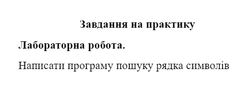

# Лабораторна робота №3

## Умова

Я зробив скріншот умови з документа з диску.



## Аналіз

З невідомої причини умова не була сформована чітко. Вона не визначає акий алгоритм ми маємо використовувати. Умова лише каже, що має бути програма пошуку рядка в рядку. Тож я виберу той, що швидше реалізувати, а може краще взагалі використовувати вбудоваий.

## Структура основних вхідних та вихідних даних

Два рядки:

1. рядок, в якому шукаємо
2. рядок, який шукаємо

## Алгоритм розв'язання задачі

## Текст програми

Program.cs

```cs
Console.WriteLine("Enter a string in which we will search (long one):");
var source = Console.ReadLine();

Console.WriteLine("Enter a string we need to search in previous string (short one)");
var search = Console.ReadLine();

if (source == null || search == null)
{
    Console.WriteLine("Input is invalid. Goodbye");
    return;
}

var indexOfSearch = source.IndexOf(search);
if (indexOfSearch < 0)
{
    Console.WriteLine($"{search} was not found");
}
else
{
    Console.WriteLine($"{search} was found at index: {indexOfSearch}");
}
```

## Результати тестування програми та аналіз отриманих помилок

Все працює. Так як я використовував вбудовану функцію.